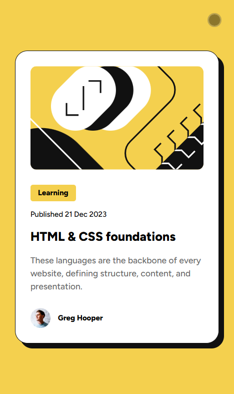
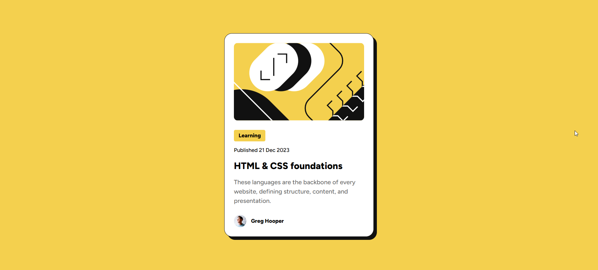

# Frontend Mentor - Blog preview card solution

This is a solution to the [Blog preview card challenge on Frontend Mentor](https://www.frontendmentor.io/challenges/blog-preview-card-ckPaj01IcS). Frontend Mentor challenges help you improve your coding skills by building realistic projects. 

## Table of contents

- [Overview](#overview)
  - [The challenge](#the-challenge)
  - [Screenshot](#screenshot)
  - [Links](#links)
- [My process](#my-process)
  - [Built with](#built-with)
  - [What I learned](#what-i-learned)
  - [Continued development](#continued-development)
  - [Useful resources](#useful-resources)
- [Author](#author)

**Note: Delete this note and update the table of contents based on what sections you keep.**

## Overview

### The challenge

Users should be able to:

- See hover and focus states for all interactive elements on the page

### Screenshot




### Links

- Solution URL: (https://github.com/Bibulka69/blog-preview-card-main.git)
- Live Site URL: (https://bibulka69.github.io/blog-preview-card-main/)

## My process

### Built with

- Semantic HTML5 markup
- CSS custom properties
- CSS media queries
- Flexbox

### What I learned

As part of the challenge, I learned how to make styles mobile-friendly without using media queries. The clamp function allows you to specify a minimum, preferred, and maximum font size. Depending on the screen width, the text will smoothly shrink or grow.

```html
<h1 class="card__title">HTML & CSS foundations</h1>
```
```css
.card__title {
    font-size: clamp(1.25rem, 1.67vw, 1.5rem);
}
```

### Continued development

As part of my training, I plan to pay more attention to studying all the pseudo classes and their capabilities.

### Useful resources

- [PX to REM converter](https://nekocalc.com/px-to-rem-converter) - This helped me quickly convert px to rem to specify the correct font size..

## Author

- Frontend Mentor - [@Orina](https://www.frontendmentor.io/profile/Bibulka69)

